# Sistema de Gerenciamento de Pacientes em Psicologia

Aplicação desenvolvida com **Python** e **Django**, utilizando **HTML** e **CSS**, pronta para deploy, voltado para a área de psicologia. O sistema permite o controle e o acompanhamento de pacientes por parte dos psicólogos(as).

## 🔧 Funcionalidades

- Cadastro de usuários para os psicólogos(as) (ativação através de e-mail enviado ao endereço de e-mail corporativo do psicólogo(a), hashing de senha e as devidas validações);
- Edição de dados do perfil dos psicólogos(as) cadastrados;
- Cadastro de pacientes (necessário estar logado, sendo um psicólogo(a));
- Gerenciamento de pacientes (apenas logado e sendo necessário ser o psicólogo(a) que cadastrou / responsável pelo paciente);
- Página com todos os pacientes de cada psicólogo(a), incluindo filtros de pesquisa;
- Registro detalhado de consultas (permitido ser realizado apenas pelo psicólogo(a) responsável pelo paciente em questão), incluindo gráfico de humor e resumo com link direto para as últimas consultas;
- Histórico de consultas com destaque visual por humor (vermelho, amarelo e branco), com link direto para os dados registrados da consulta;
- Visualização das informações das consultadas registradas;
- Banco de dados usando MySQL.

OBS: Os acessos aos pacientes, são restritos para o psicólogo responsável pelos mesmos, não acessível a outros psicólogos.

## Imagens da Aplicação

### Página Inicial - Sem Log in
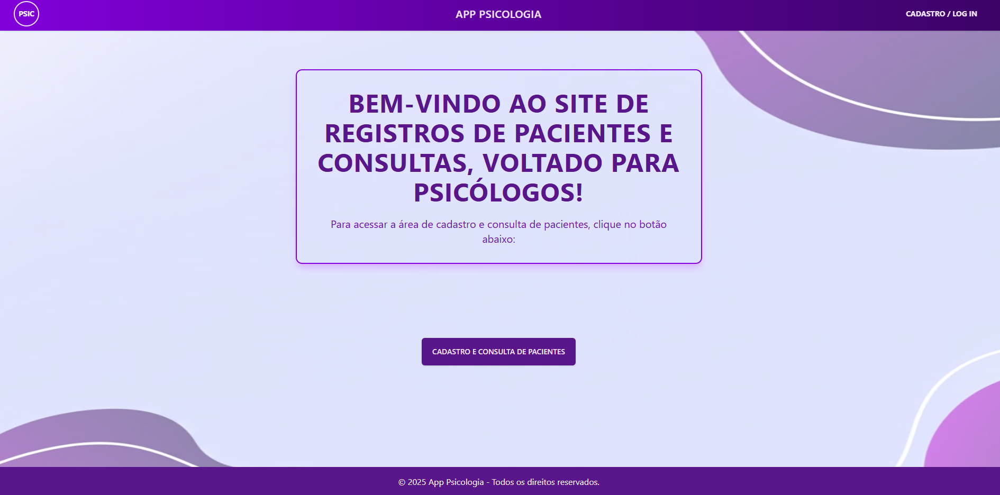

### Página Inicial - Logado 
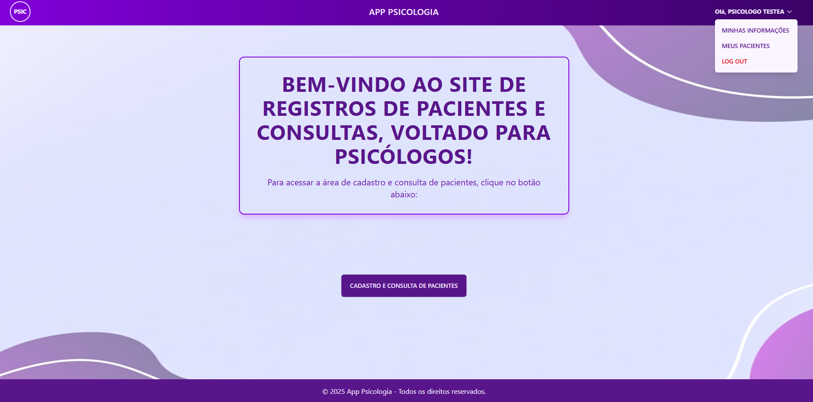

### Página de Cadastro / Log in
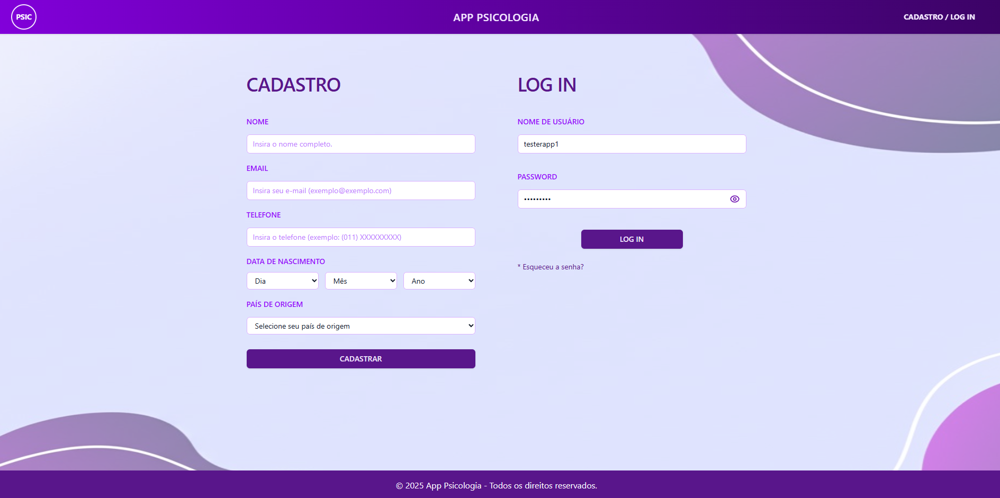

### Cadastro de Pacientes - Sem Log in
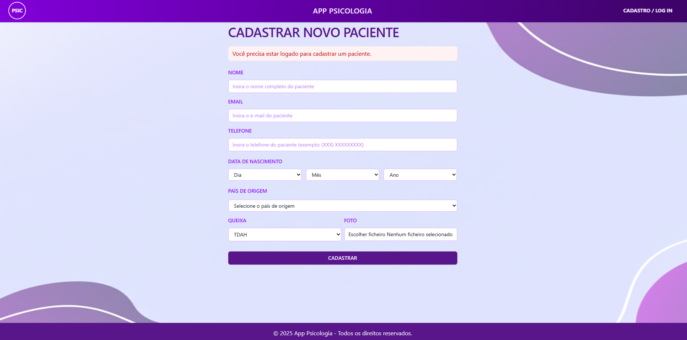

### Cadastro de Pacientes - Logado
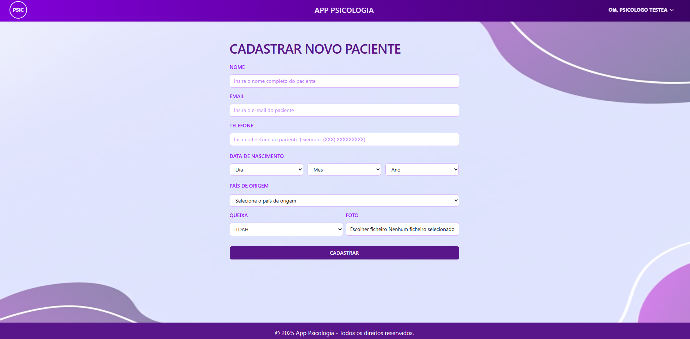

### Registro de Consulta (Parte 1) - Apenas com usuário logado e responsável pelo paciente em questão
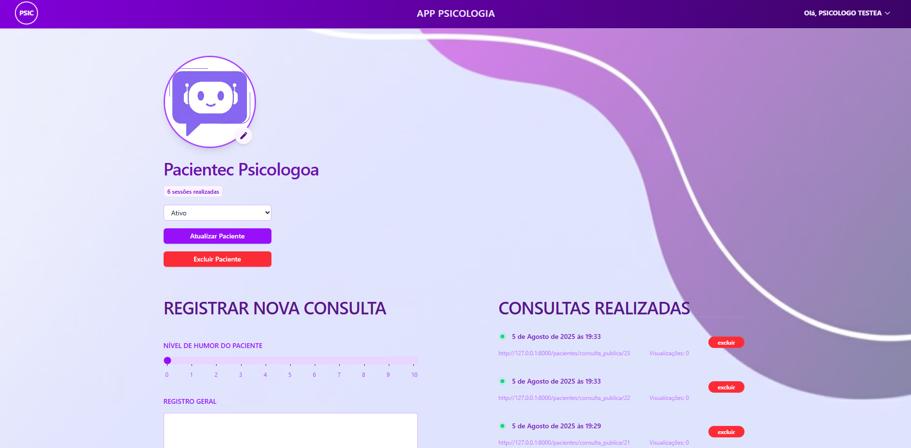

### Registro de Consulta (Parte 2) - Apenas com usuário logado e responsável pelo paciente em questão
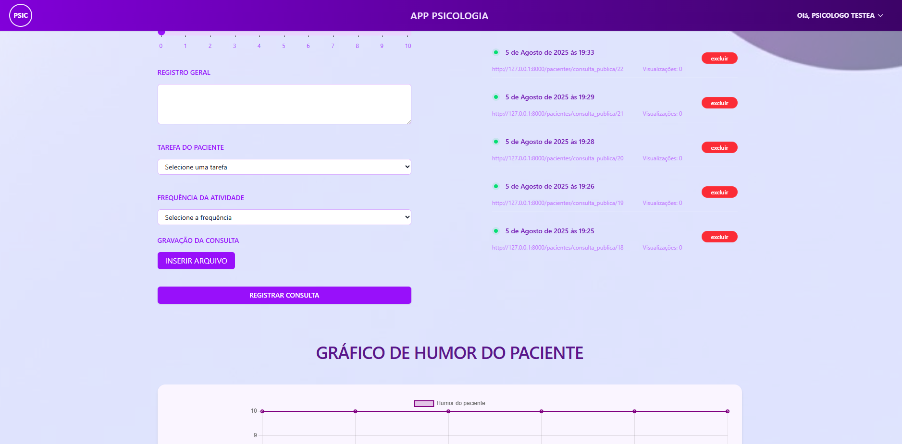

### Registro de Consulta (Gráfico) - Apenas com usuário logado e responsável pelo paciente em questão
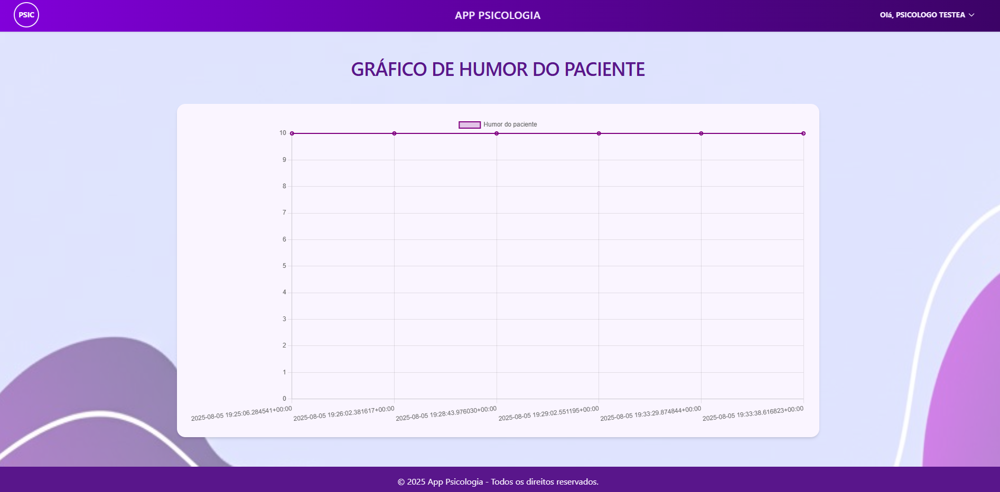

### Consulta Registrada  - Apenas com usuário logado e responsável pelo paciente em questão
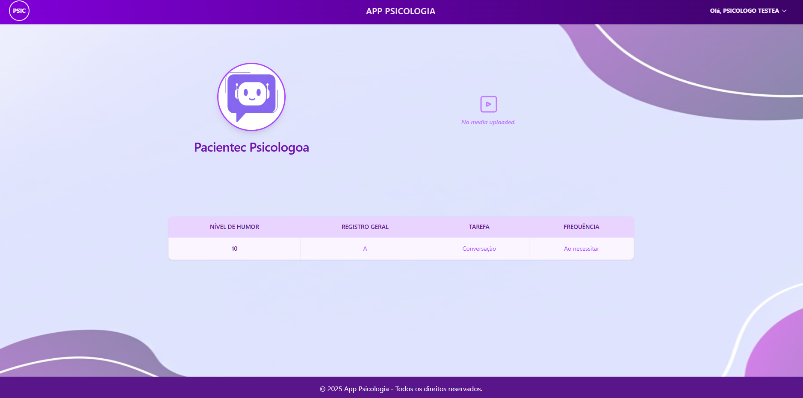

### Página de pacientes do psicólogo(a)  - Apenas com usuário logado e responsável pelo paciente em questão
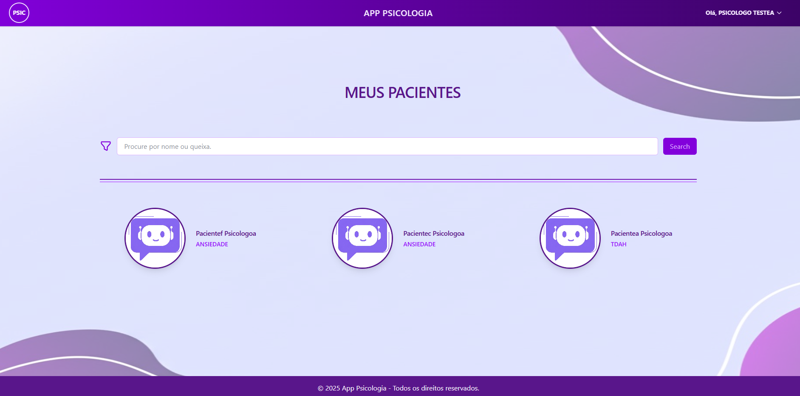

### Edição dos dados do usuário psicólogo(a)
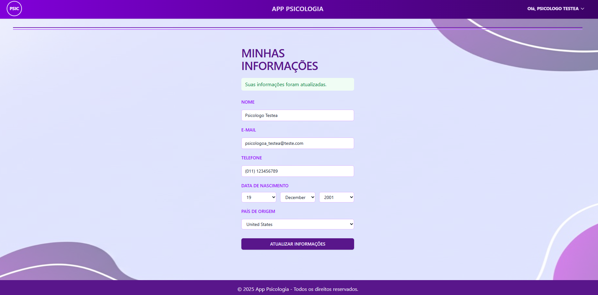

### Edição dos dados do paciente - Apenas com usuário logado e responsável pelo paciente em questão
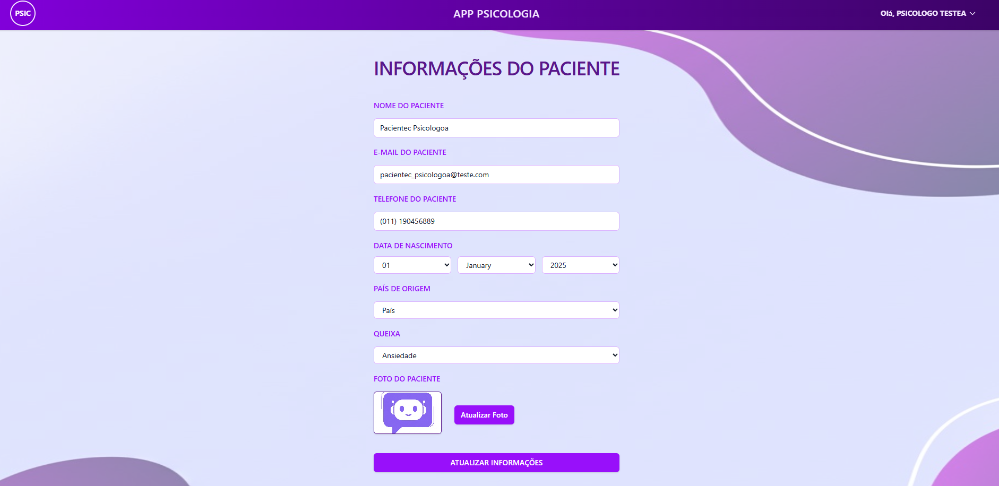

