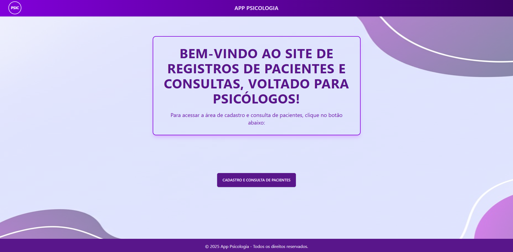
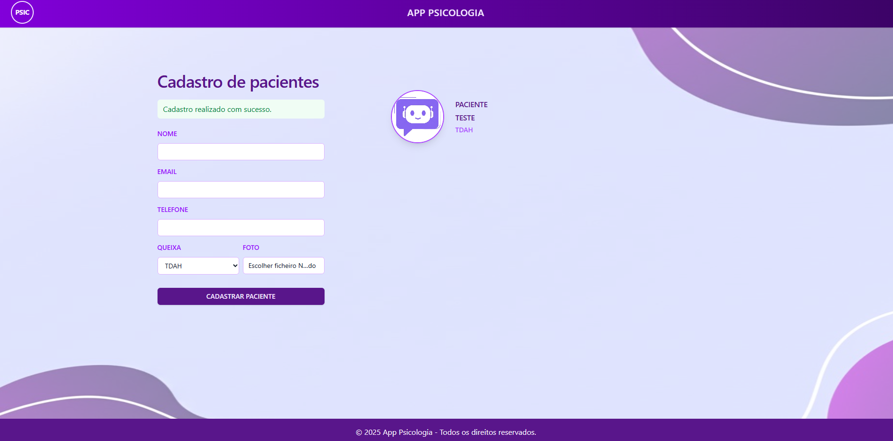
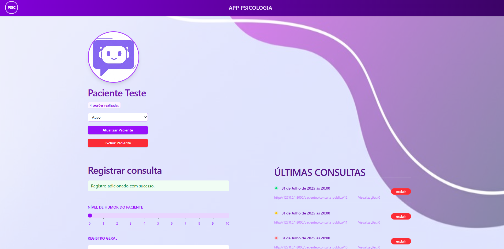
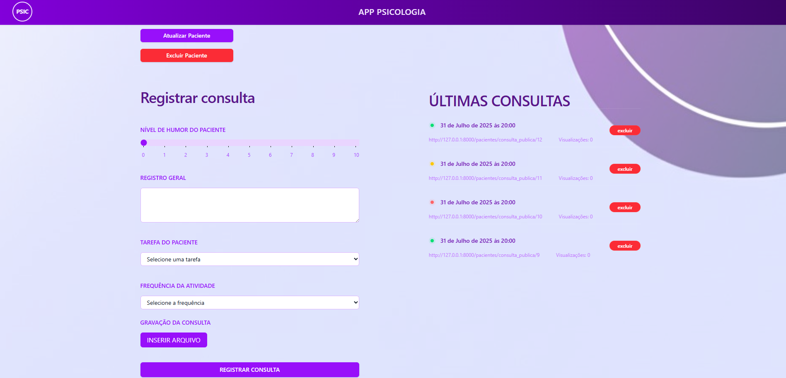
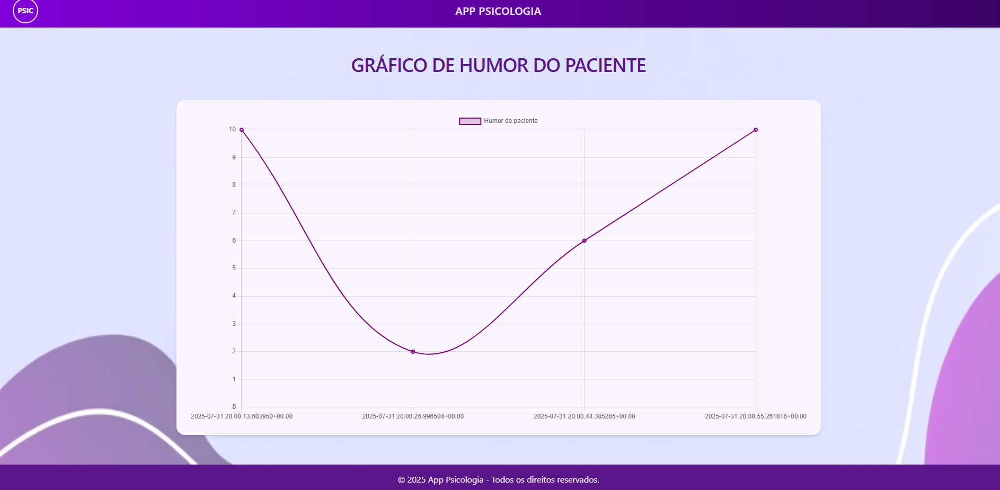
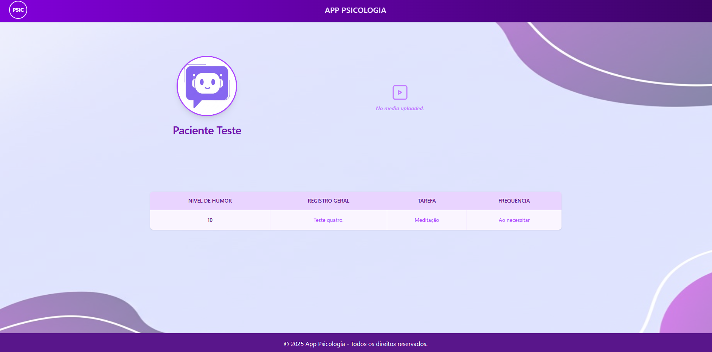

# Sistema de Gerenciamento de Pacientes em Psicologia

Aplicação desenvolvida com **Python** e **Django**, utilizando **HTML** e **CSS**, pronta para deploy. O sistema permite o controle e o acompanhamento de pacientes na área da psicologia.

## 🔧 Funcionalidades

- Cadastro e gerenciamento de pacientes;
- Registro detalhado de consultas;
- Histórico de consultas com destaque visual por humor (vermelho, amarelo e branco);
- Histórico de visualizações públicas;
- Banco de dados com consultas realizadas;
- Gráficos representando o progresso do paciente ao longo do tempo.

## Imagens da Aplicação

### Página Inicial  

### Cadastro de Pacientes  

### Registro de Consulta (Parte 1)  

### Registro de Consulta (Parte 2)  

### Gráfico de Humor  

### Consulta Registrada  

